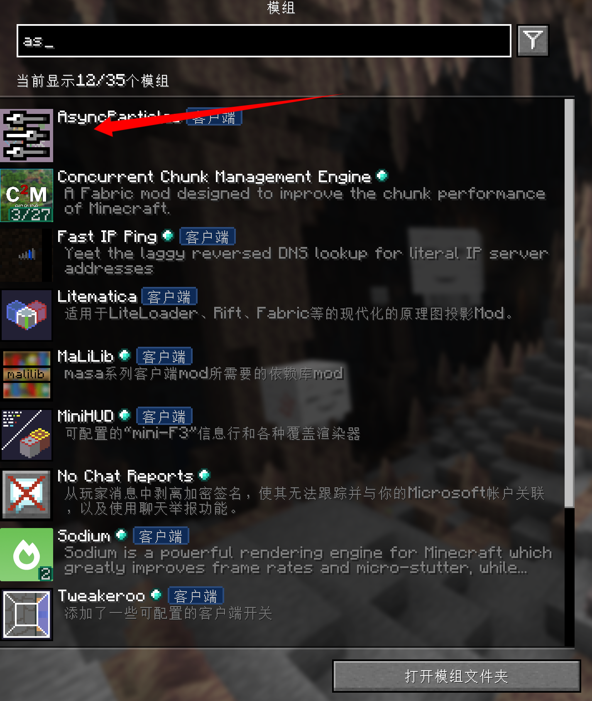
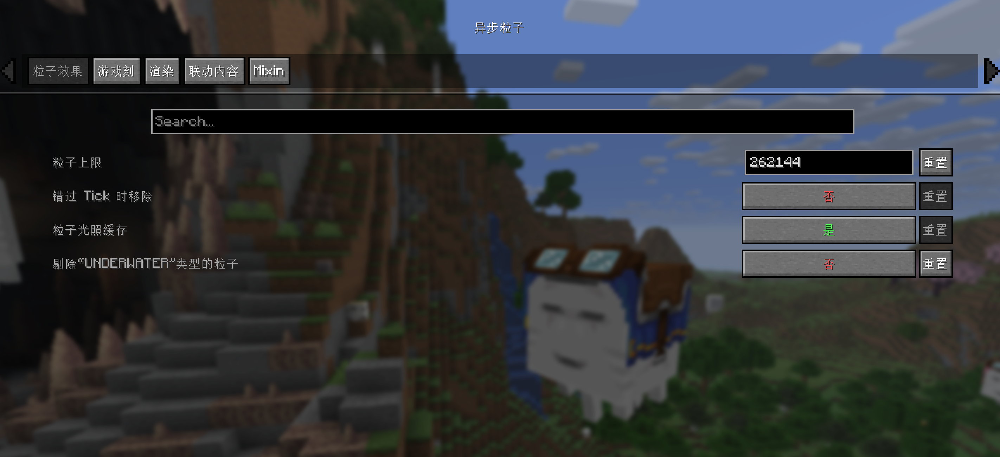
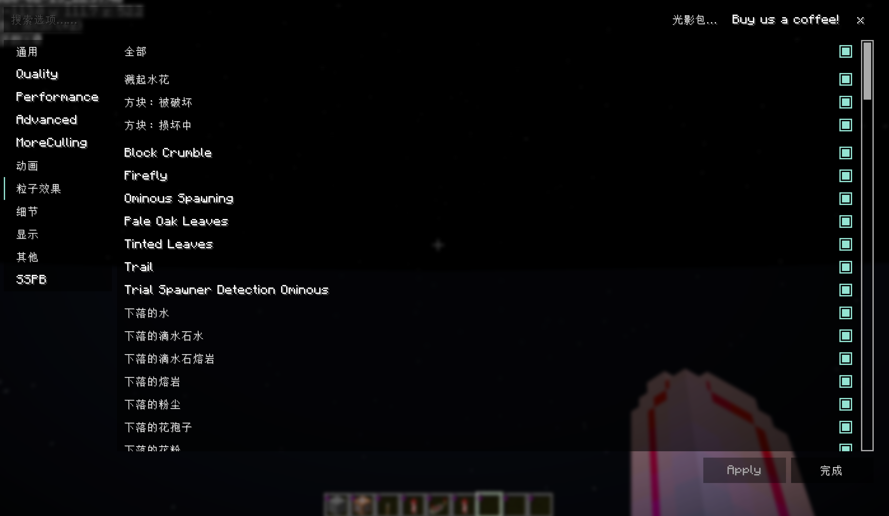
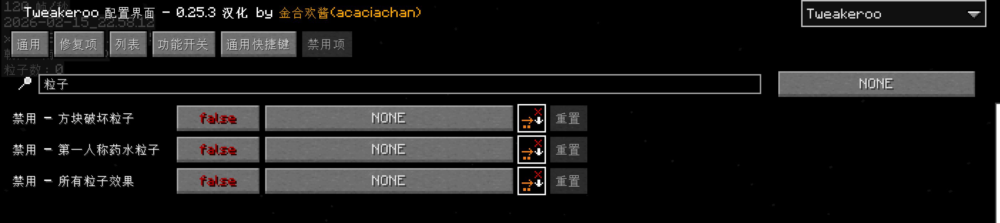
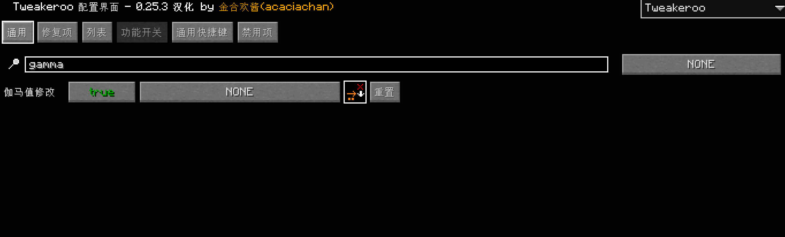
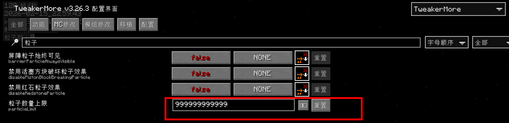

author@xhbsh

# 烟花观看指南

由于烟花表演的粒子过多,必须安装优化mod,否则无法获得正常的观看体验

**请关闭光影观看**

## 1.模组安装
下载链接 [[AsyncParticles mod|other/mod/AsyncParticles-6.3.0+1.21.8.jar]]

也可以通过启动器直接下载 AsyncParticles 模组

## 2.模组配置

配置设置如下

另外,请确保视频设置中为粒子效果全部开启
视距保持在12以上

tweakeroo和tweakermore中各类禁用粒子的选项关闭

伽马修改开启

tweakermore中的粒子上限高于26w

