author@xhbsh

# MCSM 服务端部署指南
##  管理员操作流程

### 1.1 新建实例
1.  在【实例管理】中新建一个默认的 Minecraft 服务端实例。
    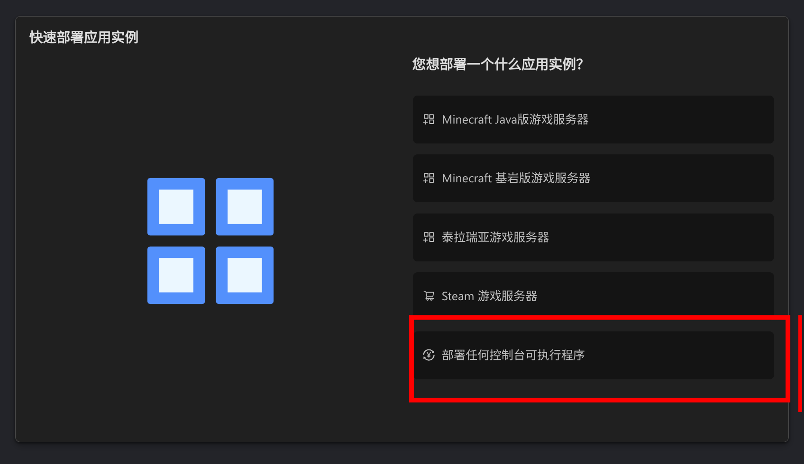
    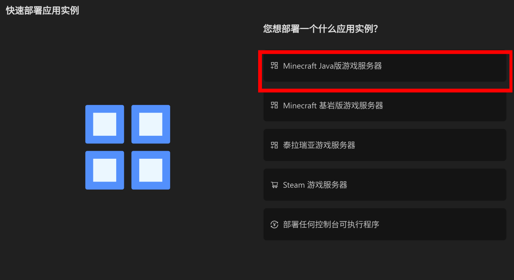

2.  **选择部署节点**：建议优先选择 **青岛** 节点。
    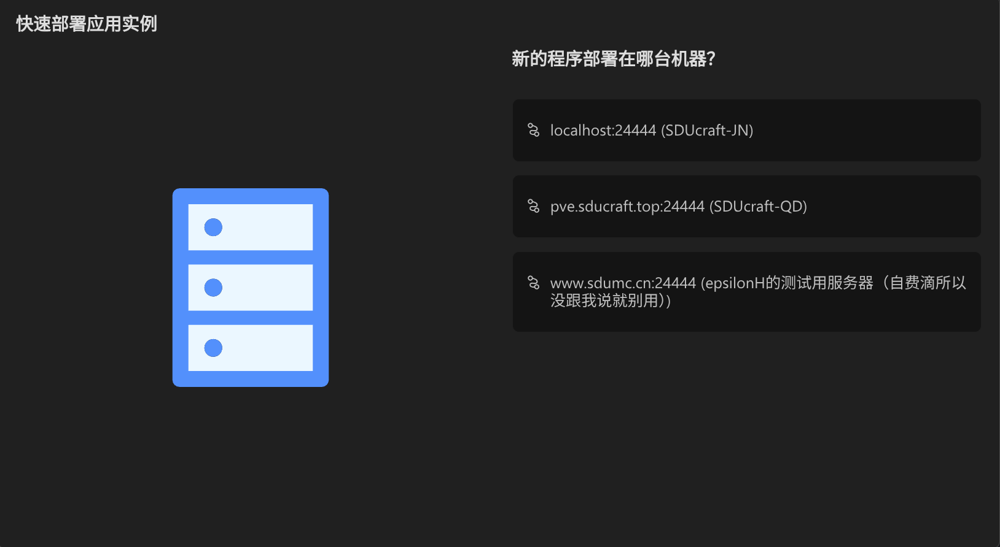

3.  **配置虚拟化**：此处**暂不勾选** Docker（为了后续能够选择特定的本地镜像）。
    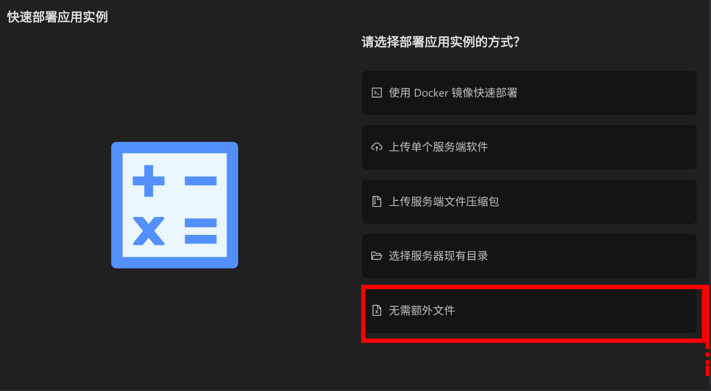

4.  **分配权限**：创建完成后，在【用户管理】界面将该实例分配给对应用户。
    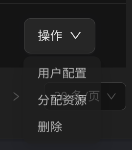

### 1.2 配置 Docker 环境
1.  点击进入刚才创建的实例控制台。
2.  前往 **功能组 -> 应用实例设置**。
3.  启用 **Docker** 开关，并选择对应 Java 版本的镜像（如需使用 MCDR，请务必选择 MCDR 专用镜像）。
    > **注意**：受网络环境限制，面板无法直接从 Docker Hub 拉取新镜像。如需使用列表之外的镜像，需手动在宿主机下载。
    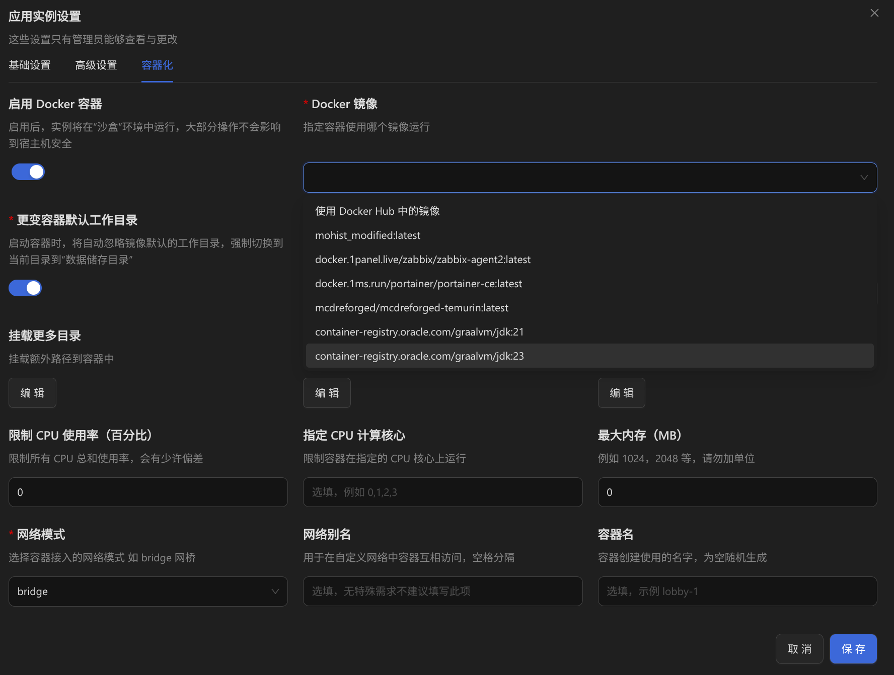

### 1.3 端口开放与网络转发
1.  **分配端口**：确定一个**空闲端口**分配给该实例。
2.  **开放端口**：在 **应用实例设置** 中，添加并开放上述端口。
    *   **容器端口** 与 **宿主机端口** 通常保持一致。
        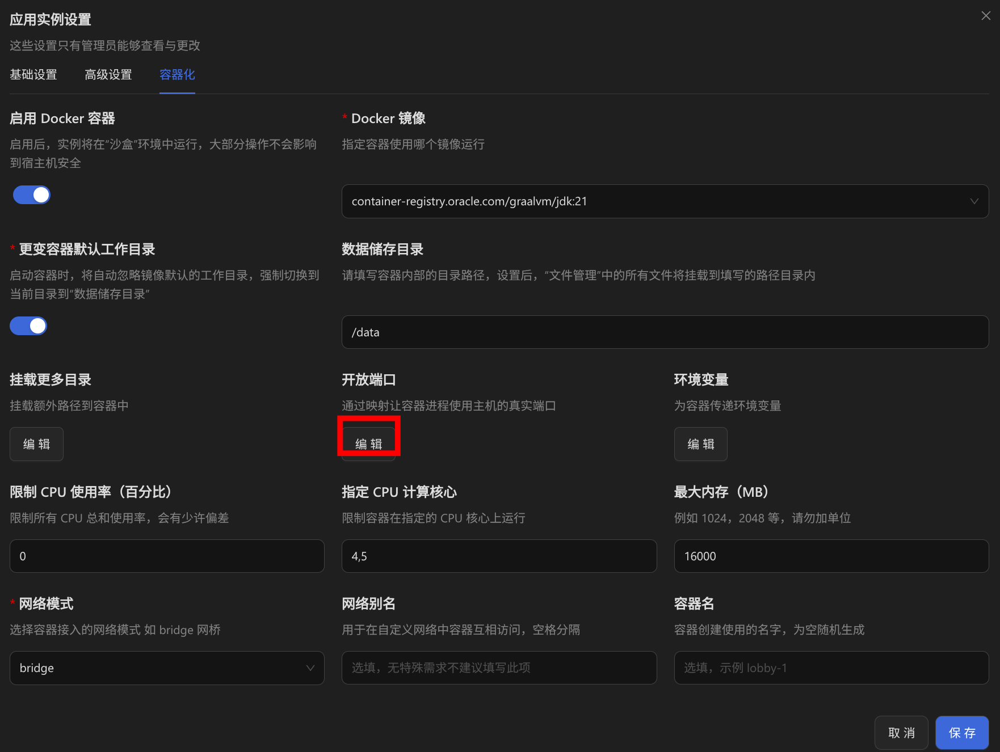
        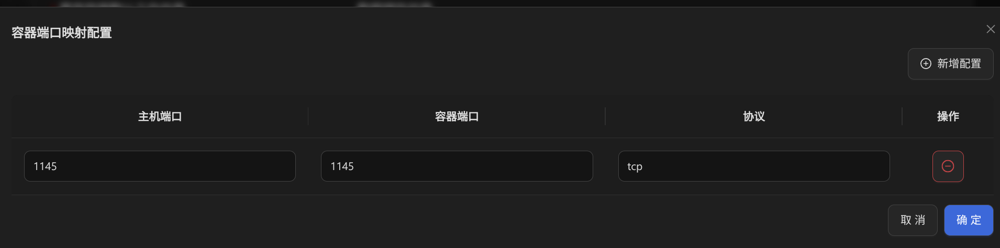
3.  **PVE 转发 (仅青岛)**：
    如果实例部署在青岛 PVE 节点，还需在 PVE 宿主机配置 NAT 转发。
    参考教程：[PVE 网络转发配置教程](./docs/server_arch/env_cfg/pve/网络转发)
4.  **通知用户**：将分配好的端口号告知用户。

---

## 用户操作流程

### 2.1 MCDR 初始化 (可选)
> 若不使用 MCDR 插件加载器，请跳过此步。

启动一次实例，MCDR 将会自动运行并初始化必要的配置文件和目录结构。
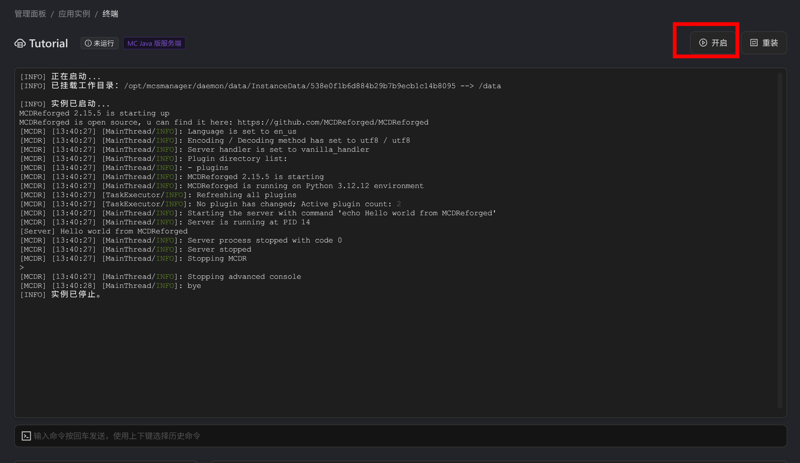
更多信息参考：[MCDR 官方文档](https://docs.mcdreforged.com/zh-cn/latest/)

### 2.2 上传服务端文件
1.  在【文件管理】中上传并解压服务端文件。
2.  **如使用MCDR**：请将服务端核心及相关文件放置在根目录下的 `server` 文件夹内。

### 2.3 设置服务端端口
1.  向管理员获取分配给你的**端口号**。
2.  在文件管理中找到 `server.properties` 文件。
3.  修改 `server-port` 项，将其设置为管理员提供的端口。
    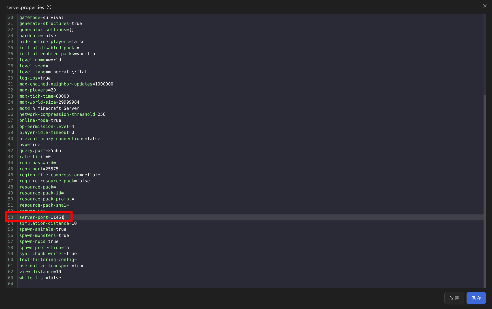

### 2.4 配置启动命令

#### 使用 MCDR
修改根目录下的 `config.yml` 配置启动命令，或直接指定启动脚本路径。
> **警告**：镜像环境为 Linux 系统，**不支持** `.bat` 批处理脚本，请使用 `.sh` (Bash) 脚本。
> 如果需要使用其他版本的java请自行准备并放至根目录中

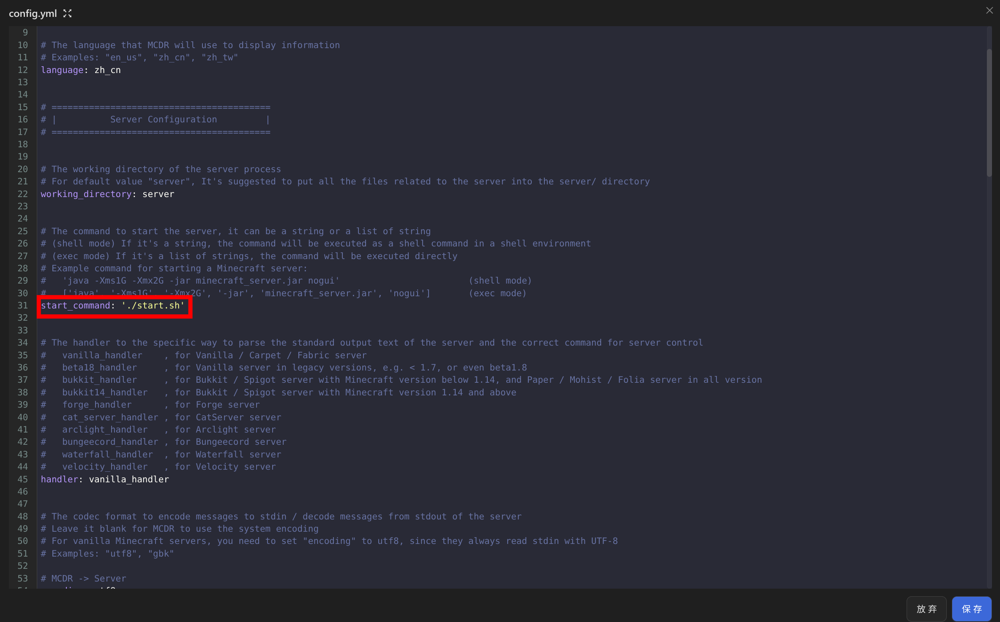

**参考启动脚本 (`start.sh`)：**
*更多参数调优请参考：[服务端调优指南](https://docs.liuliyue.cn/games/mcje/introduction/server-jvm-optimization.html)*

```bash
#!/bin/bash

# 内存设置
MEMORY="6G"

# JVM 优化参数
JAVA_ARGS="-server \
  -Xms${MEMORY} -Xmx${MEMORY} \
  -XX:+UseG1GC \
  -XX:+ParallelRefProcEnabled \
  -XX:MaxGCPauseMillis=130 \
  -XX:+UnlockExperimentalVMOptions \
  -XX:+DisableExplicitGC \
  -XX:+AlwaysPreTouch \
  -XX:G1NewSizePercent=30 \
  -XX:G1MaxNewSizePercent=40 \
  -XX:G1HeapRegionSize=8M \
  -XX:G1ReservePercent=20 \
  -XX:G1HeapWastePercent=5 \
  -XX:InitiatingHeapOccupancyPercent=15 \
  -XX:SurvivorRatio=32 \
  -XX:MaxTenuringThreshold=1 \
  -XX:+UseStringDeduplication \
  -Dfabric.development=false \
  -Dfile.encoding=UTF-8"

# 启动命令 (请根据实际文件名修改 jar 包名称)
java ${JAVA_ARGS} -jar ./fabric-server-mc.1.21.1-loader.0.18.4-launcher.1.1.1.jar nogui
```

#### 不使用 MCDR
直接在 **应用实例设置** 的“启动命令”输入框中填写启动命令或启动脚本路径。
> **注意**：此处不能直接填写多行脚本。建议填写脚本路径，如 `./start.sh`。
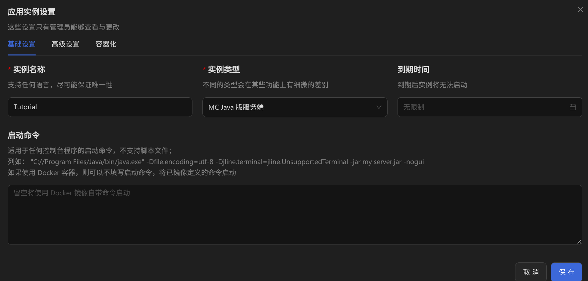

---

## 常见问题

::: qa 无法连接到青岛的节点 (xhr poll error)
**问题原因：**
高版本浏览器安全策略限制导致无法连接。

**解决方法：**
请使用低版本浏览器，推荐 **Chromium 142 及以前版本**。
:::

::: qa 启动报错 Permission denied
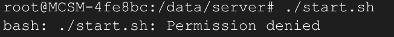

**问题原因：**
Docker 为 Linux 环境，上传的启动脚本（.sh）默认没有“可执行权限”。

**解决方法:**
1.  在 **实例 > 启动命令** 中临时填写 `bash`，启动实例进入终端。
2.  输入命令：`chmod +x <你的启动脚本名称.sh>`
3.  关闭实例，将启动命令改回原脚本路径，正常启动即可。
:::

::: qa MCDR 插件缺少依赖
**问题原因：**
直接通过上传文件安装的插件，MCDR 不会自动补全其所需的 Python 依赖库。

**解决方法:**
1.  删除缺少依赖的插件文件。
2.  在控制台使用 MCDR 命令安装插件（会自动处理依赖）。
3.  安装指令可前往 [MCDR 插件仓库](https://mcdreforged.com/zh-CN/plugins) 获取。
    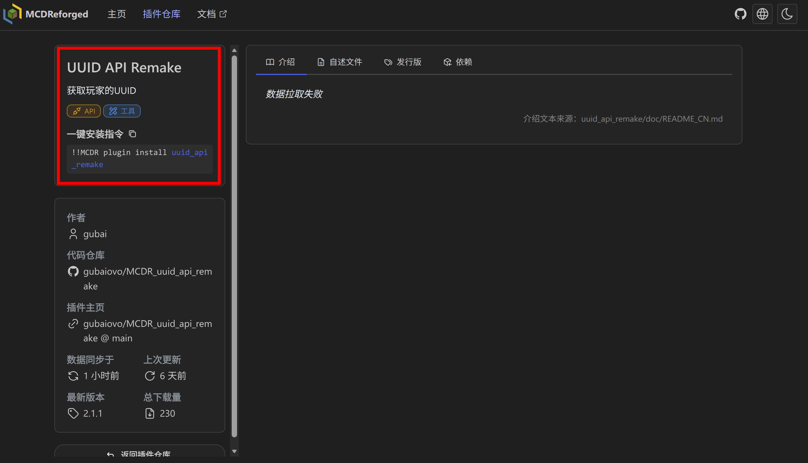
:::