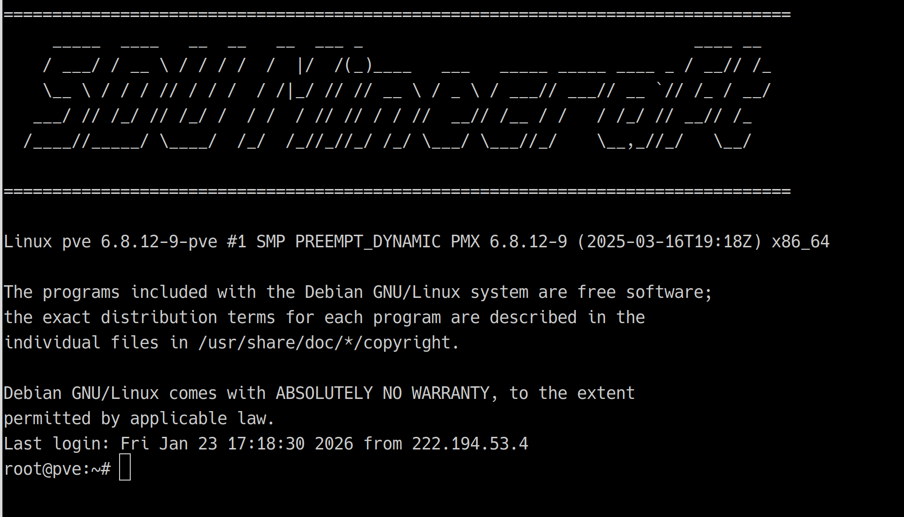

# pve网络转发配置(仅管理员使用)
## 1.使用ssh登录pve主机

密码请在技术部团队文档中获取
成功登录pve后界面如下图所示

## 2. 执行转发命令 
直接在终端输入命令，无需重启。
**模板：**
```bash
iptables -t nat -A PREROUTING -i vmbr0 -p tcp --dport <外网端口> -j DNAT --to-destination <内网IP>:<内网端口>
```
**示例**：
将 **PVE外的 1145 端口(10.xxx那个)** 转发给 **内网虚拟机 192.168.1.5 (青岛mcsm)的 11451 端口**：
```bash
iptables -t nat -A PREROUTING -i vmbr0 -p tcp --dport 1145 -j DNAT --to-destination 192.168.1.5:11451
```
> **参数说明**：
> *   `-p tcp`：协议（如需 UDP 改为 `-p udp`）。
> * 看不懂的千万别改!!!!!!!!! 请只替换命令中的端口号
> * 慎用ai 小心把iptable删没了

### 2. 测试连通性
在你的电脑尝试连接刚才设置的端口（如1145）。

### 3. 保存配置 (持久化)
测试通过后，执行以下命令将规则保存：
```bash
netfilter-persistent save
```
### 4. 删除错误的配制
如果不小心输错了，把命令中的 `-A` (添加) 改成 `-D` (删除) 再执行一遍即可。

**示例（删除刚才的规则）：**
```bash
iptables -t nat -D PREROUTING -i vmbr0 -p tcp --dport 1145 -j DNAT --to-destination 192.168.1.5:11451
```
